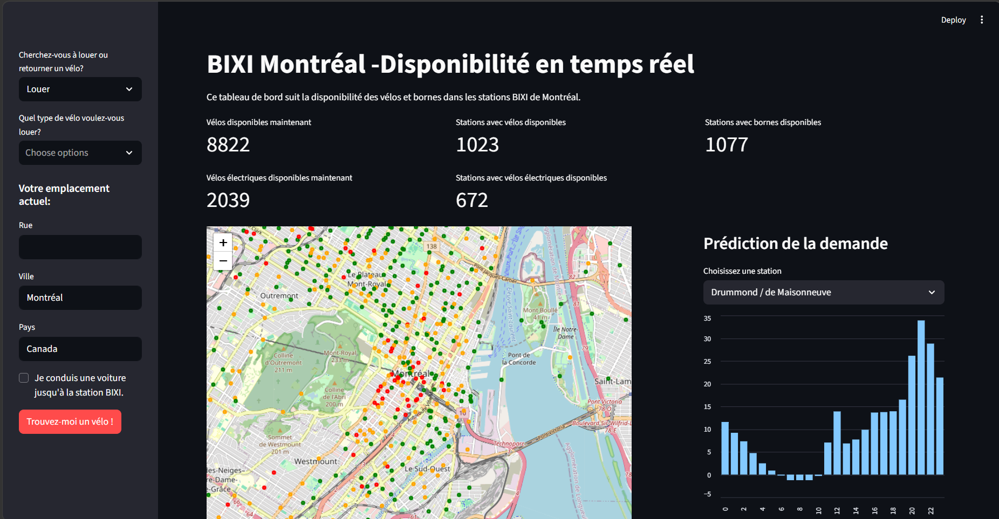

# Bixi-live-tracker

## Aperçu du projet

<p align="center">
  
</p>

## Ce que le projet fait

BIXI Live Tracker est une application web interactive construite avec **Streamlit**.

Elle affiche en temps réel la disponibilité des vélos dans les stations BIXI de Montréal à partir du flux officiel **GBFS (General Bikeshare Feed Specification)**.

Le site permet de :

* Visualiser toutes les stations BIXI sur une carte dynamique.
* Distinguer les vélos mécaniques et les vélos électriques.
* Trouver la station la plus proche pour louer ou retourner un vélo.
* Consulter des indicateurs clés sur la flotte BIXI en direct.
* Prédire la demande horaire de vélos pour une station à partir de données historiques.
* Comparer les performances de deux approches de Machine Learning : **LightGBM** et un **réseau de neurones MLP développé avec PyTorch**.

## Pourquoi le projet est utile

Ce projet facilite la planification des déplacements à vélo à Montréal en combinant des **données temps réel**, de la **géolocalisation** et du **Machine Learning**.

L'utilisateur peut rapidement identifier une station disposant de vélos ou de bornes libres à proximité et choisir entre un vélo mécanique ou électrique.

La fonctionnalité de prédiction permet également d'anticiper la demande horaire pour une station donnée.

Le projet explore deux approches de prédiction différentes afin d'évaluer leur performance sur les données historiques BIXI : un modèle de gradient boosting **LightGBM** et un réseau de neurones **PyTorch MLP avec embedding des stations**.

## Prise en main du projet

### Installation

```bash
# Cloner le dépôt
git clone https://github.com/<votre-nom>/bixi-live-tracker.git
cd bixi-live-tracker

# Créer un environnement virtuel
python -m venv .venv

# macOS/Linux
source .venv/bin/activate

# Windows
.venv\Scripts\activate

# Installer les dépendances
pip install -r requirements.txt
```

### Lancement de l'application

```bash
streamlit run app.py
```

Le site sera accessible sur :

http://localhost:8501

## Entraînement des modèles

Les modèles sont entraînés à partir des données historiques de trajets publiées par BIXI Montréal.

Télécharger les fichiers CSV depuis :

https://bixi.com/en/open-data/

Puis les placer dans un dossier `data/`.

### LightGBM

```bash
python train_model.py --data-dir data --output model.pkl
```

Le modèle LightGBM est utilisé pour générer les prédictions affichées dans l'application.

### PyTorch MLP

```bash
python train_model_pytorch.py --data-dir data --output model_pytorch.pt
```

Le second modèle est un réseau de neurones **MLP développé avec PyTorch**.

Un embedding est utilisé pour représenter les différentes stations BIXI avant de combiner cette représentation avec des variables temporelles comme :

* l'heure ;
* le jour de la semaine ;
* le mois ;
* le statut semaine / fin de semaine.

Ce modèle est principalement utilisé afin de comparer une approche neuronale avec LightGBM sur le même problème de prédiction.

## Données exploitées

### Données en temps réel

Le site repose sur les données ouvertes fournies par BIXI Montréal via la spécification **GBFS (General Bikeshare Feed Specification)**.

Source principale :

```text
https://gbfs.velobixi.com/gbfs/2-2/gbfs.json
```

Ce flux fournit notamment :

* `station_information.json` : métadonnées des stations, coordonnées et capacité ;
* `station_status.json` : vélos disponibles, bornes libres et types de vélos.

### Données historiques

Les modèles de prédiction sont entraînés sur les données historiques de trajets publiées annuellement par BIXI Montréal.

Les fichiers contenant plusieurs millions de trajets sont traités par blocs afin de limiter l'utilisation de la mémoire lors du prétraitement.

## Fonctionnalités principales

### 🗺️ Carte interactive

Affiche les stations BIXI de Montréal avec leur disponibilité en temps réel.

Un code couleur permet d'identifier rapidement les stations selon le nombre de vélos disponibles.

### 🚲 Vélos électriques et mécaniques

Les vélos électriques (`ebike`) et mécaniques (`mechanical`) sont comptabilisés séparément.

L'utilisateur peut choisir le type de vélo recherché.

### 📊 Indicateurs clés

L'application affiche notamment :

* le nombre total de vélos disponibles ;
* le nombre de vélos électriques disponibles ;
* le nombre de stations disposant de vélos ;
* le nombre de stations disposant de bornes libres.

### 📍 Recherche géographique

L'utilisateur peut entrer une adresse afin de rechercher automatiquement une station BIXI appropriée à proximité.

### 🚶 Itinéraire automatique

Un itinéraire jusqu'à la station choisie ainsi qu'une estimation de la durée du trajet sont obtenus grâce à l'API **OSRM**.

### 🔮 Prédiction de la demande

Le modèle LightGBM prédit le nombre de départs attendus pour chaque heure de la journée à une station sélectionnée.

Le modèle est entraîné sur plus de **14 millions de trajets historiques**, traités par blocs afin de gérer efficacement le volume de données.

Sur les données de test, LightGBM obtient :

* **MAE : 4.58 départs/heure**
* **RMSE : 7.30 départs/heure**

### 🧠 Comparaison des modèles

Deux architectures ont été évaluées sur la même tâche de prédiction :

| Modèle      |      MAE |     RMSE |
| ----------- | -------: | -------: |
| LightGBM    | **4.58** | **7.30** |
| PyTorch MLP |     6.44 |    10.86 |

Le modèle PyTorch est un réseau de neurones MLP utilisant un **embedding des stations** afin de représenter les centaines de stations BIXI.

Dans cette expérimentation, **LightGBM obtient de meilleures performances sur les données de test** et est donc retenu comme modèle principal pour les prédictions affichées dans l'application.

Cette comparaison permet d'évaluer concrètement deux familles de modèles différentes sur des données tabulaires structurées.

## 🧰 Technologies

* **Langage :** Python 3.12
* **Application web :** Streamlit
* **Traitement de données :** pandas, NumPy
* **Cartographie :** Folium, streamlit-folium
* **Machine Learning :** LightGBM, scikit-learn
* **Deep Learning :** PyTorch
* **Sérialisation :** joblib, torch
* **APIs :** GBFS BIXI Montréal, OSRM
* **Données :** données temps réel GBFS et historique des trajets BIXI
